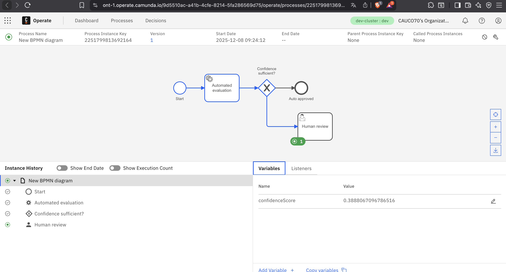

# Camunda Governed Decision Flow

Este proyecto es un **ejemplo funcional de un flujo BPMN ejecutado en Camunda 8 Cloud**, donde una decisión automatizada determina si un caso se aprueba automáticamente o pasa a revisión humana.

El objetivo es demostrar un **patrón típico de decisión gobernada**:
- Automatización primero
- Reglas claras
- Intervención humana solo cuando es necesario

---

## 🧭 Arquitectura general

- **Camunda 8 Cloud (SaaS)**
  - BPMN modelado y desplegado en Camunda Cloud
  - Monitoreo en Operate
- **Worker Node.js**
  - Implementado localmente
  - Conectado al cluster Cloud vía OAuth
  - Ejecuta la lógica automática y retorna variables al proceso

---

## 🧩 Flujo BPMN

1. **Start**
2. **Automated evaluation** (Service Task)
   - Ejecutado por un worker Node.js
   - Calcula un `confidenceScore`
3. **Exclusive Gateway – "Confidence sufficient?"**
   - Si `confidenceScore >= 0.8` → Auto approved
   - Si `confidenceScore < 0.8` → Human review
4. **Human review** (User Task)
   - Revisión manual solo cuando la automatización no es suficiente

---

## 📸 Ejecución real en Camunda Operate

La siguiente captura muestra una instancia real del proceso ejecutándose en Camunda Cloud, con la variable `confidenceScore` producida por el worker:



> Nota: la variable `confidenceScore` es devuelta por el worker y evaluada por el gateway para determinar el camino del flujo.

---

## 🧑‍💻 Worker (Node.js)

El worker está implementado usando `zeebe-node` y se conecta a Camunda Cloud mediante variables de entorno.

### Lógica principal
- Escucha jobs del tipo: `automated-evaluation`
- Genera un valor de confianza (mock)
- Completa el job enviando la variable al proceso

### Ejemplo simplificado (`worker.js`)

```js
import { ZBClient } from "zeebe-node";
import "dotenv/config";

const zbc = new ZBClient();
console.log("Worker conectado a Camunda Cloud 🚀");

zbc.createWorker({
  taskType: "automated-evaluation",
  taskHandler: async (job) => {
    const confidenceScore = Math.random();
    console.log("Calculated confidenceScore:", confidenceScore);

    await job.complete({ confidenceScore });
    console.log("Job completado ✅");
  }
});
```

---

## ⚙️ Configuración

### Variables de entorno (`.env` – NO versionado)

```env
ZEEBE_CLIENT_ID=your-client-id
ZEEBE_CLIENT_SECRET=your-client-secret
ZEEBE_ADDRESS=cluster-id.region.zeebe.camunda.io:443
ZEEBE_AUTHORIZATION_SERVER_URL=https://login.cloud.camunda.io/oauth/token
```

### Archivo de ejemplo incluido
Se incluye un `.env.example` sin credenciales reales.

---

## 🚀 Ejecución

1. Instalar dependencias:
```bash
npm install
```

2. Configurar `.env`

3. Ejecutar el worker:
```bash
node worker.js
```

4. Desplegar el BPMN desde Camunda Modeler / Web Modeler  
5. Iniciar una instancia y observarla en **Camunda Operate**

---

## ✅ Estado del proyecto

- ✅ BPMN desplegado en Camunda Cloud
- ✅ Worker conectado y procesando jobs
- ✅ Variables visibles en Operate
- ✅ Flujo automatizado + humano funcionando correctamente

---

## 🎯 Propósito

Este repositorio sirve como:
- Ejemplo práctico de **Camunda 8 Cloud**
- Base para flujos de decisión gobernados
- Demostración de integración BPMN + workers externos

---

## 🏁 Notas finales

Este proyecto **no utiliza infraestructura local (Docker, Java, Elasticsearch)**.  
Todo se ejecuta sobre **Camunda Cloud SaaS**, siguiendo un enfoque moderno y mantenible.

---